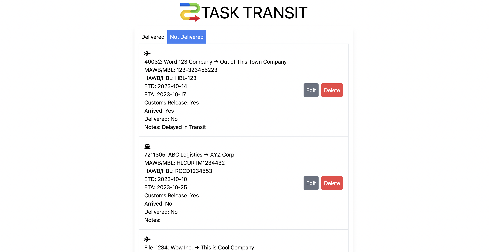

# Task Transit

A smooth and efficient file transition tracker TaskTransit is a streamlined web application built using React, Django, Axios, and Tailwind CSS. Designed to help users track their files through various pivotal statuses like "Customs Released", "Arrived", and "Delivered". It offers functionalities to add, modify, and remove file entries while also updating their delivery status with ease.



## Overview

Task Transit assists in tracking the transition of files through various statuses such as "Customs Released", "Arrived", and "Delivered". Users can add, edit, and delete file entries, while also toggling their delivery status. 

## Table of Contents

- [Features](#features)
- [Technology Stack](#technology-stack)
- [Setup & Installation](#setup-&-installation)
- [Usage](#usage)
- [Contributing](#contributing)
- [License](#license)

## Features

- **File Tracking:** Keep track of files with statuses like "Customs Released", "Arrived", and "Delivered".
- **Add/Edit/Delete Files:** Easily manage files with intuitive UI controls.
- **Status Filter:** View files based on their delivery status.
- **Responsive Design:** Built with Tailwind CSS for a sleek and responsive UI.

## Technology Stack

- **Frontend:** React.js with Tailwind CSS
- **Backend:** Django
- **API Calls:** Axios
- **Database:** (Upcoming) PostgreSQL

## Setup & Installation

### Prerequisites

- Node.js
- Python
- Pipenv (or other Python environment manager)
  
### Backend Setup

1. Navigate to the backend directory.
2. Set up a virtual environment: 
    ```shell
    pipenv shell
    ```
3. Install dependencies: 
    ```shell
    pipenv install
    ```
4. Run migrations (ensure you're in the virtual environment):
    ```shell
    python manage.py migrate
    ```
5. Run the server:
    ```shell
    python manage.py runserver
    ```
   
### Frontend Setup

1. Navigate to the frontend directory.
2. Install dependencies:
    ```shell
    npm install
    ```
3. Start the development server:
    ```shell
    npm start
    ```
   
## Usage

Visit `localhost:3000` in your browser to use the application on your local machine.

## Contributing

Your contributions are always welcome! Please fork the repository and create a pull request with your changes or open an issue to discuss what you would like to change.

## License

[MIT License](https://choosealicense.com/licenses/mit/)

---

**Note**: Feel free to customize sections as per your project needs and add any additional sections that might be relevant (like Screenshots, API documentation, etc.)

Remember to replace placeholder text and code snippets with actual code or instructions relevant to your project!
